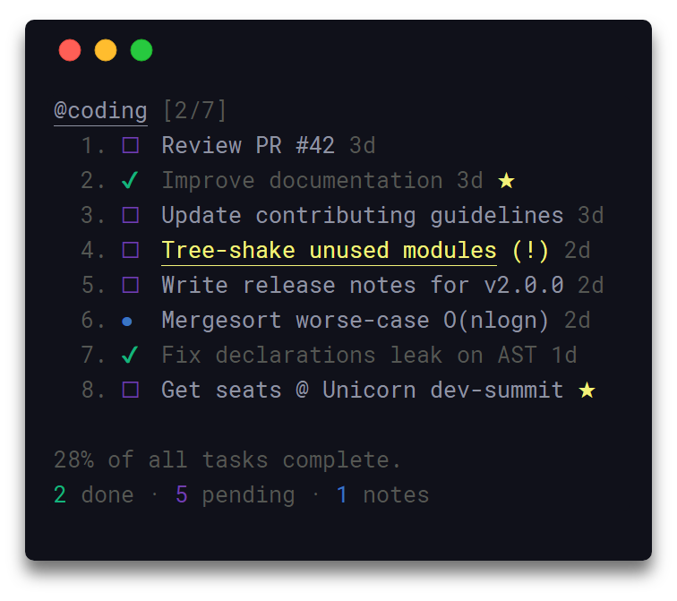

# TaskApp
A Simple application for noting your Tasks, or Notes

---

Built With
- ElectronJS - 15.0.0
- NodeJS - v16.10.0
- Electron Forge - 6.0.0
- NPM - 7.24.0

Install Required Modules: ```npm install```

Run The Application: ```npm start```

Compile To Executable: ```npm run make```

---

# Inspiration
I was inspired by this CLI Tool named [taskbook](https://github.com/klaussinani/taskbook)



And Made my own GUI using [Electron JS](https://www.electronjs.org/) Framework (because i was learning electron js)


---

# THANKS
