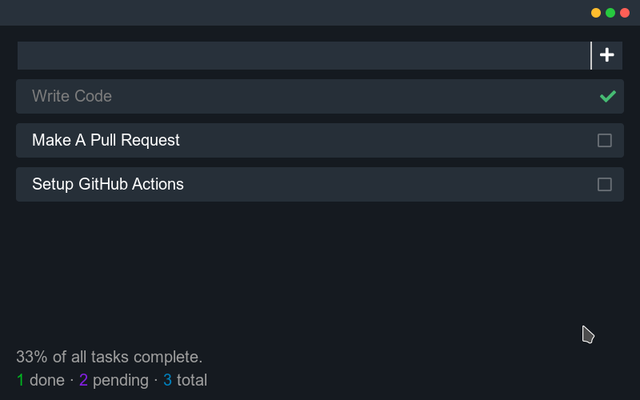

# TaskApp
A Simple application for noting your Tasks or Notes, Built using [NeutralinoJs](https://github.com/neutralinojs/neutralinojs)

---
## Download
Get The Latest Binaries From [GitHub Releases](https://github.com/DEVLOPRR/taskapp/releases)

---
## Preview


---

## Building From Source

Get The Repository Using `git`:

```bash
git clone https://github.com/DEVLOPRR/taskapp
```

Change Directory To Cloned Folder And Install Dependencies:

```bash
cd taskapp
npm install
npm install -g @neutralinojs/neu
neu update
```

Build:

```bash
npm run build
```

---

# THANKS
